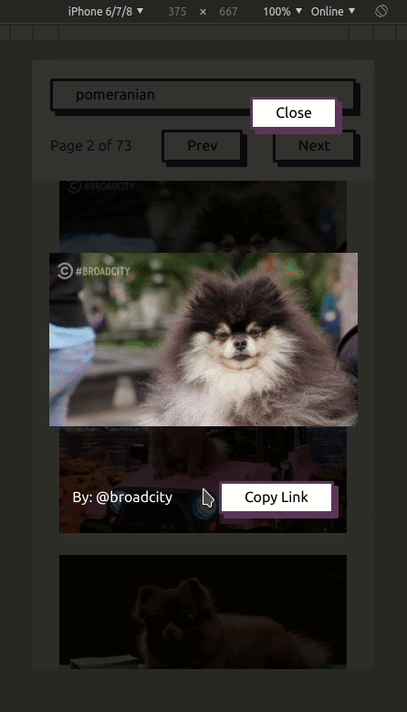
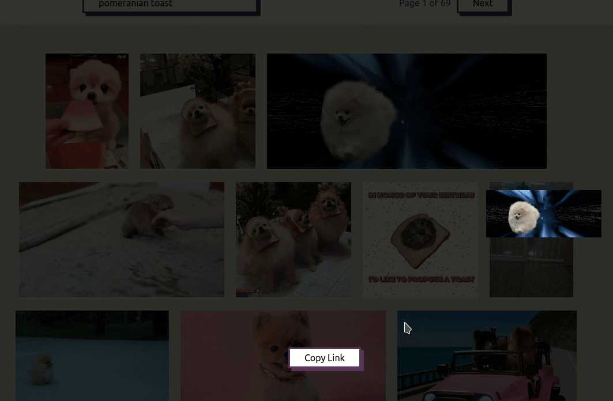
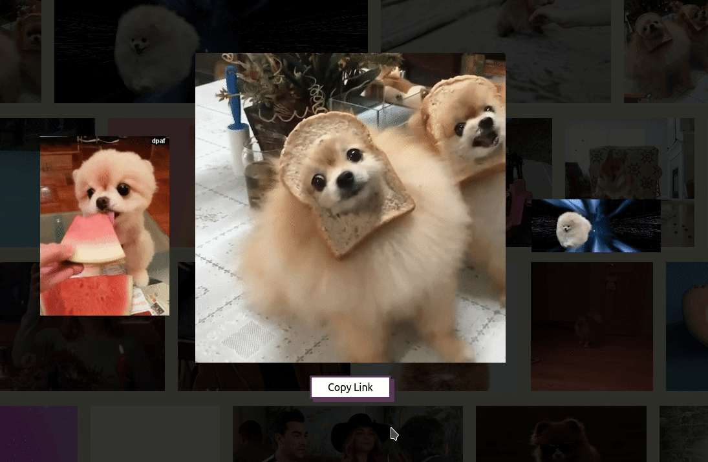

# Gifter
A gif viewer using the giphy API.


## Development

```sh
git clone https://github.com/dobladov/gifter.git
npm install
cp .env.example .env # Edit the information with the correct
npm start
```

If the .env is not properly read by parcel, please do `rm -R dist .cache`, this is a [documented](https://parceljs.org/env.html) bug of parcel.

Run linters

```sh
npm test
```

A new server will be running on [localhost:1234](http://localhost:1234).

# Production
```
npm run build
```

A new build will be at the dist/ folder.

## Important files

```sh
index.tsx # Initializes the react app and adds style normalizing

# Components
App.tsx # Main logic for the app, holding the other components
Header.tsx # Simple header showing the logo and slogan
ItemList.tsx # Creates a gallery with he given items
LightBox.tsx # Creates a lightbox base on the current gif, showing the previous and next
Pagination.tsx # Creates a pagination based on the current page, tota_items, offset and count
Search.tsx # Form for making new search agains the api

# Other
common.ts # File for shared functions among components
globalStyles.css # Styles that are not namespaced
site.webmanifest # Manifest for PWA
index.html # Entry point for the app
deploy.yml # Github action to host the code
```

## Hightlights

The UI works well on mobile devices.


The lightbox supports both touch (swipe) and keyboard naviation.
- Escape key closes the lightbox.
- Left, Right arrow keys load the next and previous gif.



For slow connections (In this case slow 3g) the downgraded preview is shown.



Quite fast loading next pages even with non cached resources.


Links can be copied to clipboard.



If no search is present post from trending are loaded.